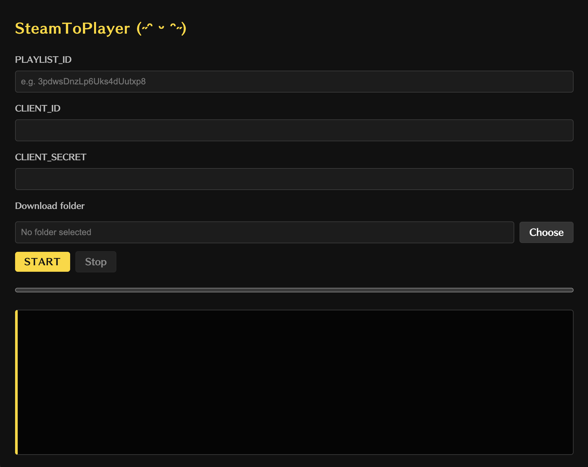
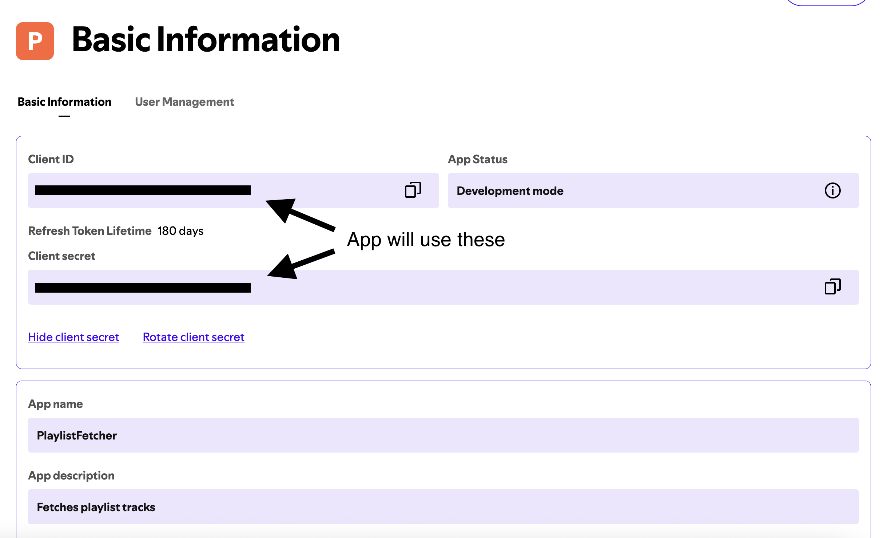

# What is SteamToPlayer?

A desktop application that allows you to download music from Spotify playlists to your local machine. It uses the youtube-dl-exec library to download the music, and the ffmpeg-static library to convert the audio to mp3.



# How did it become a thing?

There was a time when I caught myself sitting on the gym equipment, staring at my phone, scrolling through reels, and this shit disappointed me. I'm not ADHD, but this damn brick was sucking out my mind during my workouts. Not long ago I aquired an MP3 player to stay focused (at least in the gym). When I tried to manually download my playlist, I caught myself crying like a damn fool. Then I remembered that I'm actually a programmer and I can automate this stuff. This is how the project was born. \o/

# Installation guide (Last tested in July 2026)

## 1. Install the app

Download the correct installer for your operating system from the latest GitHub release:

Windows: `.exe`

macOS: `.dmg`

## 2. Create a Spotify app

This app needs Spotify API credentials to read playlist data.

1. Open the Spotify Developer Dashboard: https://developer.spotify.com/dashboard
2. Sign in with your Spotify account
3. Click _Create app_
4. Enter a name and description
5. Set the redirect URI to `http://127.0.0.1:8888/callback`
6. Save the app and copy the Client ID and Client Secret



## 3. Get a playlist ID

You need the Spotify playlist ID to download tracks from a playlist.

1. Open the Spotify playlist in Browser
2. Copy the playlist ID
3. The playlist ID is the part after `/playlist/`

Example:

URL: `https://open.spotify.com/playlist/37i9dQZF1DXcBWIGoYBM5M`

Playlist ID: `37i9dQZF1DXcBWIGoYBM5M`

## 4. Start the app

1. Launch the app
2. Paste the Playlist ID
3. Paste your Spotify Client ID
4. Paste your Spotify Client Secret
5. Paste the Playlist ID
6. Choose a folder for the downloaded music
7. Click Start

# Build from source

If you want to build it yourself:

```bash
npm install
npm run typecheck
npm run build:app
```

To create installers locally:

```bash
npm run dist
```
